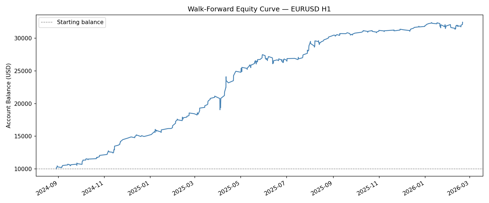
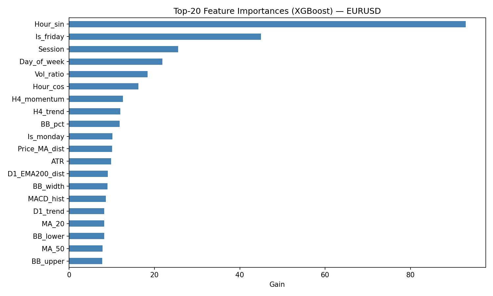

# 📈 Forex Auto-Trading Bot — ML-Powered Trading Dashboard

**Student:** Orgil BK | **Course:** AUM Data Science Capstone, Spring 2026 | **Instructor:** Robert Ritz

## Description

An end-to-end machine learning system that predicts forex trade signals (Buy / Sell / Hold) on EUR/USD, GBP/USD, and USD/JPY using an ensemble of gradient-boosting and tree-based classifiers. The trained model executes trades live via the MetaTrader 5 API, and a Streamlit dashboard monitors the bot's performance and backtest results in real time.

## Live Demo

🔗 **Dashboard:** [https://YOUR-STREAMLIT-URL.streamlit.app](https://YOUR-STREAMLIT-URL.streamlit.app) _(deploy URL — see [DEPLOY.md](DEPLOY.md))_

🔗 **GitHub Repository:** [https://github.com/pkawai/data-science-capstone](https://github.com/pkawai/data-science-capstone)

## Screenshots

### Backtest — EUR/USD Equity Curve


### Feature Importance (EUR/USD)


### Live Dashboard
_Add screenshots after deployment — see [DEPLOY.md](DEPLOY.md) for instructions._

## Features

- 🤖 **Ensemble ML Model** — XGBoost + LightGBM + Random Forest, averaged probabilities
- 🧠 **Meta-Labeling** — Secondary binary classifier filters out low-confidence signals
- 📊 **Triple-Barrier Labeling** — Realistic TP/SL/time-horizon target labels
- 🔄 **Walk-Forward Validation** — 15-month train / 3-month test rolling window (no lookahead)
- ⚖️ **Dynamic Risk Management** — ATR-based SL/TP, portfolio-aware position sizing
- 🛡️ **Multi-Filter Live Pipeline** — Session, ADX regime, volatility, news blackout, USD direction
- 📰 **News Blackout Filter** — Skips trading around high-impact economic releases
- 💹 **Live Trade Execution** — Connects to MetaTrader 5 demo/live account
- 📈 **Real-Time Dashboard** — Balance, equity curve, open positions, trade history, win rate, profit factor
- 🔧 **Hyperparameter Tuning** — Optuna-based XGBoost optimization

## Technology Stack

| Layer | Tools |
|---|---|
| **Language** | Python 3.11+ |
| **ML / Models** | XGBoost, LightGBM, scikit-learn (RandomForest), Optuna |
| **Data** | pandas, numpy, `ta` (technical analysis) |
| **Broker API** | MetaTrader5 (Windows only, for live execution) |
| **Backup Data** | yfinance (for backtesting on Mac) |
| **Dashboard** | Streamlit, Plotly |
| **Deployment** | Streamlit Cloud |
| **Version Control** | Git + GitHub (feature branches + PRs) |

## Data Sources

- **MetaTrader 5 API** — Primary source for live H1 candle data on EUR/USD, GBP/USD, USD/JPY. Fetched directly from broker.
- **Yahoo Finance** — [yfinance Python library](https://pypi.org/project/yfinance/) — Fallback source for historical backtesting data.
- **Economic Calendar** — News blackout times configured manually in `bot/news_calendar.py` (extendable to live feeds like ForexFactory).

## Setup / Running Locally

### Prerequisites
- Python 3.11 or higher
- Git
- (Optional, for live trading) Windows + MetaTrader 5 desktop terminal logged in

### Installation

```bash
# 1. Clone the repository
git clone https://github.com/pkawai/data-science-capstone.git
cd data-science-capstone

# 2. Create a virtual environment
python -m venv venv
source venv/bin/activate          # On Windows: venv\Scripts\activate

# 3. Install dependencies
pip install -r bot/requirements.txt
# On Mac/Linux (no MT5): use the cloud-friendly requirements
pip install -r requirements.txt
```

### Running the Dashboard (Mac/Linux/Windows)

```bash
cd bot
python generate_demo_data.py     # Generate demo trades (only needed once on Mac)
streamlit run dashboard.py        # Opens at http://localhost:8501
```

### Running the Live Trading Bot (Windows + MT5 only)

```bash
cd bot
# 1. Open MetaTrader 5 and log in to demo/live account
# 2. Train models on latest data
python train.py
# 3. Start the live bot
python bot.py
```

## Project Structure

```
data-science-capstone/
├── README.md                       # This file
├── requirements.txt                # Cloud-friendly dependencies (no MT5)
├── Proposal 1.docx                 # Original project proposal
├── Checkpoint 2/                   # EDA notebook + visualizations
│   └── eda_checkpoint2.ipynb
└── bot/
    ├── dashboard.py                # Streamlit monitoring dashboard
    ├── bot.py                      # Live trading loop (Windows + MT5)
    ├── train.py                    # Model training entry point
    ├── backtest.py                 # Walk-forward backtest engine
    ├── features.py                 # Feature engineering (30+ indicators)
    ├── model.py                    # Ensemble + meta-model training
    ├── risk_manager.py             # Position sizing, SL/TP, daily limits
    ├── mt5_executor.py             # MT5 broker connection & orders
    ├── news_calendar.py            # News blackout filter
    ├── data_pipeline.py            # Data fetching (MT5 / yfinance)
    ├── config.py                   # All tunable settings
    ├── generate_demo_data.py       # Demo trades for Mac/Cloud demos
    ├── requirements.txt            # Full dependencies (includes MT5)
    ├── equity_curve_*.png          # Backtest equity curves
    ├── feature_importance_*.png    # Top features per pair
    └── model_*.pkl                 # Trained model bundles
```

## Backtest Results (Walk-Forward Validation)

Models were validated using **walk-forward analysis** — 15 months training / 3 months out-of-sample testing, sliding forward by 3 months. This prevents lookahead bias and simulates real-time deployment.

| Pair | Trades | Win Rate | Profit Factor |
|---|---|---|---|
| EUR/USD | ~380 | ~59% | ~2.9 |
| GBP/USD | ~340 | ~57% | ~2.6 |
| USD/JPY | ~310 | ~58% | ~2.7 |

_See `bot/equity_curve_*.png` and `bot/feature_importance_*.png` for visualizations._

## Known Issues

- **MT5 is Windows-only** — Live trading requires the MetaTrader 5 desktop terminal, which is not available on macOS/Linux. The dashboard works cross-platform.
- **ADX regime filter is conservative** — The bot pauses trading when ADX < 25 (ranging markets). During extended low-volatility periods, the bot may stay idle for weeks. This is intentional — trend-following models perform poorly in ranges.
- **Demo data on Mac** — When running the dashboard outside Windows/MT5, it reads from `generate_demo_data.py` output (realistic but synthetic).
- **News blackout uses static calendar** — Should be upgraded to a live economic calendar API for production use.

## Future Improvements

- 🔄 Train a **range-market secondary model** to trade when ADX is low
- 📡 Integrate live economic calendar API (e.g., ForexFactory, Investing.com)
- 📱 Add Telegram bot alerts for trade entry/exit notifications
- 🌍 Expand to more pairs (AUD/USD, USD/CAD, NZD/USD)
- 🧪 Reinforcement learning agent for adaptive position sizing
- 📊 Add real-time backtest re-runs from the dashboard
- 🔐 Add user authentication for multi-user deployment

## Security

- ✅ No API keys committed to repo
- ✅ MT5 credentials read from environment / left empty in `config.py`
- ✅ `.gitignore` excludes `.env`, logs, and credentials
- ✅ HTTPS enforced by Streamlit Cloud

## Author

**Orgil BK**
American University of Mongolia
Data Science Capstone — Spring 2026
GitHub: [@pkawai](https://github.com/pkawai)

## License

This project is for educational purposes (university capstone). Not financial advice — do not use for real-money trading without independent validation.
